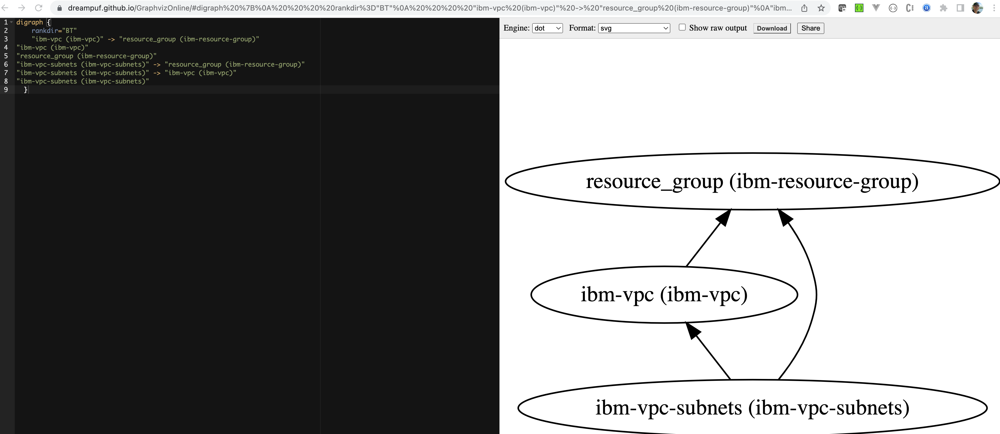

# iascable-starting-point

This is just a starting point to use IasCable.

Resource:

* [Iascable](https://github.com/cloud-native-toolkit/iascable)


### Step 1: Install CLI

```sh
curl -sL https://raw.githubusercontent.com/cloud-native-toolkit/iascable/main/install.sh | sh
```

### Step 2: Verify the installation

```sh
iascable build
```

* Example output:

```sh
Configure (and optionally deploy) the iteration zero assets

Options:
      --version                   Show version number   [boolean]
      --help                      Show help             [boolean]
  -u, --catalogUrl                The url of the module catalog.
                                  Can be https:// or file:/
                                  protocol.
   [default: "https://modules.cloudnativetoolkit.dev/index.yaml"]
  -i, --input                     The path to the bill of
                                  materials to use as input
                                                          [array]
  -r, --reference                 The reference BOM to use for
                                  the build               [array]
  -o, --outDir                    The base directory where the
                                  command output will be written
                                            [default: "./output"]
      --platform                  Filter for the platform
                                  (kubernetes or ocp4)
      --provider                  Filter for the provider (ibm or
                                  k8s)
      --tileLabel                 The label for the tile.
                                  Required if you want to
                                  generate the tile metadata.
      --name                      The name used to override the
                                  module name in the bill of
                                  material.               [array]
      --tileDescription           The description of the tile.
      --flattenOutput, --flatten  Flatten the generated output
                                  into a single directory (i.e.
                                  remove the terraform folder).
                                                        [boolean]
      --debug                     Flag to turn on more detailed
                                  output message        [boolean]
```

### Step 3: Create a `Bill of Materials`(BOM) file 

```sh
nano firstbom.yaml
```

Copy following content into the new file:

```yaml
apiVersion: cloudnativetoolkit.dev/v1alpha1
kind: BillOfMaterial
metadata:
  name: ibm-vpc
spec:
  modules:
    - name: ibm-vpc
    - name: ibm-vpc-subnets
```

### Step 4: Execute following command

```sh
iascable build -i firstbom.yaml
```

### Step 5: Verify the created content

```sh
├── firstbom.yaml
└── output
    ├── ibm-vpc
    │   ├── apply.sh
    │   ├── bom.yaml
    │   ├── dependencies.dot
    │   ├── destroy.sh
    │   └── terraform
    │       ├── docs
    │       │   ├── ibm-resource-group.md
    │       │   ├── ibm-vpc-subnets.md
    │       │   └── ibm-vpc.md
    │       ├── ibm-vpc.auto.tfvars
    │       ├── main.tf
    │       ├── providers.tf
    │       ├── variables.tf
    │       └── version.tf
    └── launch.sh
```

* `output/ibm-vpc/terraform` folder

| Filename | Content |
| --- | --- |
| `output/ibm-vpc/terraform/main.tf` | Here you see a number of modules defined including the defined `ibm-vpc` and `ibm-vpc-subnets` from the BOM file. |
| `ibm-vpc/terraform/providers.tf` | Simply contains the needed cloud provider information. In that case what we need to specify for `IBM Cloud`. |
| `output/ibm-vpc/terraform/variables.ft` | Contains the specification for the used variable in the `main.tf` or other Terrafrom files. |
| `output/ibm-vpc/terraform/version.ft` | Contains the specification for the used Terrafrom provider sources and versions. In that case only IBM is listed.|
| `output/ibm-vpc/terraform/ibm-vpc.auto.tfvars` | That file can be used to configure the variable values. (maybe add to .gitignore) During the execution of `terraform plan` and `terraform apply` you will be ask for input, if you didn't specify that values. |

* The `output/launch.sh` file

That script download and starts a container on your local machine. The objective to ensure that the right environment is used for applying the Terraform configuration.

It attaches the local path to the container and a volume.

> Note: Need to ensure you have a container engine on your machine. Best Docker! Because by default is uses Docker. Attach doesn't work for `podman` on macOS.

* The `output/ibm-vpc/apply.sh` file

That file converts an existing `variable.yaml` file or variable in the `BOM` file to a `variables.tf` and then executes `terraform init` and `terraform apply`.

* The `output/ibm-vpc/destroy.sh` file

That file simply executes the `terraform init` and 
`terraform destroy -auto-approve` commands.

* The `ibm-vpc/dependencies.dot` file

That file contains the dependencies which can be visualized for example with [Graphviz Online](https://dreampuf.github.io/GraphvizOnline/).

Example: 

### Step 6: Execute the `terraform init`

Navigate to the `output/ibm-vpc/terraform` folder and execute the `terraform init` command.

```sh
cd output/ibm-vpc/terraform
terraform init
```

### Step 6: Execute the `terraform plan`

Execute the `terraform plan` command.

```sh
terraform plan
```

Here you can see the interaction:

```sh
var.ibmcloud_api_key
  the value of ibmcloud_api_key

  Enter a value: 
```

